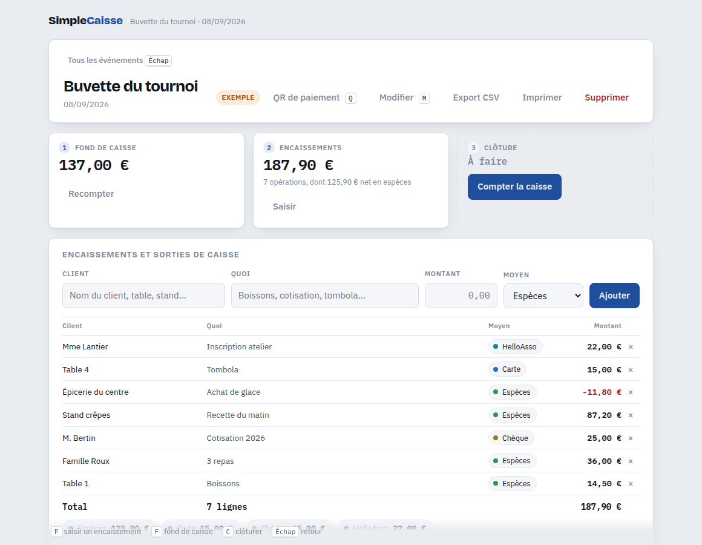
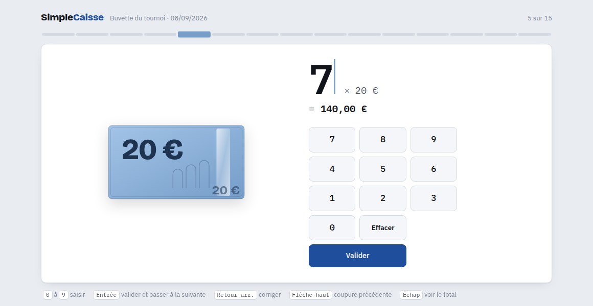

# SimpleCaisse

Le bordereau de caisse d'un événement associatif, de l'ouverture à la reddition de comptes.
Fond de caisse, encaissements de la journée, comptage de clôture, écart de caisse justifié
et signé. Buvette, brocante, loto, kermesse.

Une seule page HTML : aucun compte, aucune installation, aucune connexion, rien qui sorte
de l'appareil.

## Utilisation

Téléchargez [`SimpleCaisse.html`](SimpleCaisse.html) (bouton **Download raw file** en haut
à droite du fichier) et ouvrez-le dans un navigateur. C'est tout : pas d'installation, pas de
compte. Le fichier se garde sur le bureau, se transmet par courriel ou sur une clé USB, et se
dépose tel quel sur n'importe quel hébergement statique. Un `index.html` de redirection est
fourni pour l'usage à la racine d'un domaine ou sur GitHub Pages.

Deux entrées :

- **Simple comptage** : compter les billets et les pièces, obtenir le total. Rien n'est enregistré.
- **Suivi d'événement** : fond de caisse, encaissements au fil de l'activité, clôture, réconciliation.

## Ce que ça fait

**Réconciliation de fin d'événement.** C'est le coeur de l'outil. Fond de caisse
+ encaissements en espèces − sorties = espèces attendues, comparées aux espèces
réellement comptées. L'écart est qualifié (caisse juste, excédent, manquant), avec en
regard le chiffre d'affaires tous moyens, les dépenses et le montant à déposer en banque.
La billetterie en ligne vous dit ce qui a été vendu sur internet ; elle ne vous dit pas
si la caisse tombe juste. C'est ce chaînon qui manque partout.

**Justificatif signé.** Impression avec cases de visa (comptée par, vérifiée par) et export
CSV, prêt à ouvrir dans un tableur français : l'événement complet, ou le seul comptage quand
on ne fait qu'un comptage simple. De quoi archiver la recette d'une buvette et la présenter
au trésorier ou en assemblée générale.

**Encaissements au fil de l'activité.** Client, objet, montant, moyen de paiement (espèces,
carte, chèque, HelloAsso, autre). Un montant négatif compte comme une sortie de caisse. Les
noms et libellés déjà saisis sont proposés à la frappe suivante.

**Comptage guidé.** Une coupure par écran, du billet de 500 au centime. Chaque billet et
chaque pièce est dessiné à l'échelle de ses dimensions réelles, on reconnaît la coupure
sans lire. On tape le nombre, `Entrée` valide et passe à la suivante, le total se fait seul.
Un bénévole qui n'a jamais vu l'outil compte sa caisse sans explication.

**Paiement en ligne.** Un lien de billetterie ou de paiement (HelloAsso ou autre) par
événement, affichable en QR code plein écran à poser sur la table, imprimable en affichette.

## Raccourcis clavier

Tout se fait au clavier ou au pavé numérique, sans quitter les mains du comptage.

| Écran | Touches |
|---|---|
| Accueil | `E` suivi d'événement · `S` simple comptage · flèches pour parcourir la liste |
| Événement | `P` saisir un encaissement · `F` fond de caisse · `C` clôturer · `M` modifier · `Q` QR de paiement · `Échap` retour |
| Comptage | `0` à `9` · `Entrée` valide et enchaîne · `Retour arrière` corrige · flèches pour naviguer · `Échap` voir le total |
| Bilan | `Entrée` valider · `P` encaissements · `C` clôture · `R` reprendre le comptage |

Un pavé numérique est également affiché à l'écran pour l'usage sur tablette.

## Vos données

Tout reste dans le navigateur de l'appareil (`localStorage`). Rien n'est envoyé nulle part,
il n'y a ni serveur ni statistiques. Effacer les données du site efface les événements :
exportez le CSV pour conserver une trace.

## Sous le capot

Un fichier de 316 ko, `SimpleCaisse.html`, sans build, sans installation, sans cadriciel. Le code de
l'application est du HTML, du CSS et du JavaScript écrits à la main. Tout le reste est
embarqué dans le fichier, ce qui permet à la page de fonctionner à l'identique sans
connexion : aucune requête réseau n'est émise à l'ouverture ni pendant l'usage.

### Composants intégrés

| Composant | Rôle | Licence |
|---|---|---|
| [qrcode-generator](https://github.com/kazuhikoarase/qrcode-generator) 1.4.4, Kazuhiko Arase | Génération des QR codes de paiement | MIT |
| [Bricolage Grotesque](https://fonts.google.com/specimen/Bricolage+Grotesque), Mathieu Triay | Titres et chiffres des coupures | SIL OFL 1.1 |
| [IBM Plex Sans](https://fonts.google.com/specimen/IBM+Plex+Sans), IBM | Texte de l'interface | SIL OFL 1.1 |
| [IBM Plex Mono](https://fonts.google.com/specimen/IBM+Plex+Mono), IBM | Montants et colonnes chiffrées | SIL OFL 1.1 |

Les polices sont incluses en woff2 base64, restreintes au sous-ensemble latin. Les billets,
les pièces et les QR codes sont dessinés en SVG par la page, sans image externe.

## Licence

MIT, voir [LICENSE](LICENSE). Réutilisation, modification et usage commercial libres,
en conservant la mention de copyright. Les licences des composants embarqués sont
rappelées dans [NOTICE.md](NOTICE.md).

---

Studio Dragamig, Flavien Mauny.
Développé avec l'aide de Claude Code d'Anthropic.
